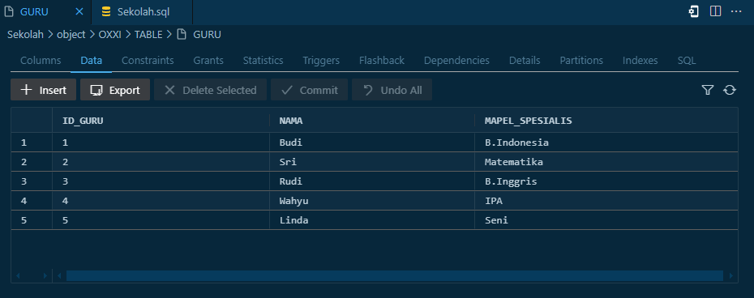
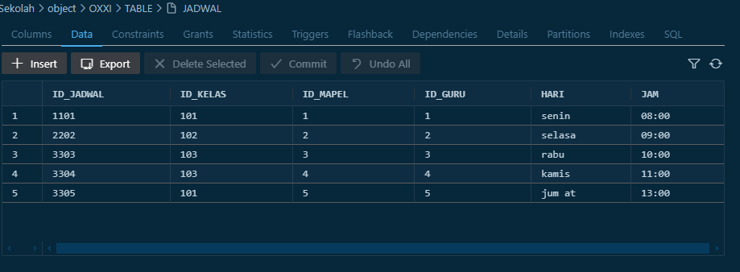
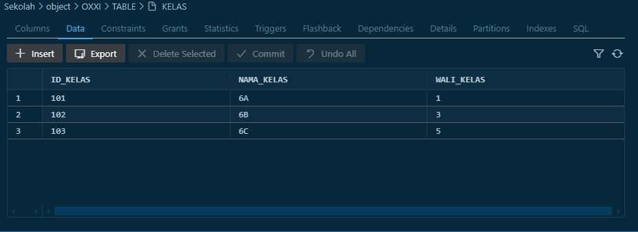
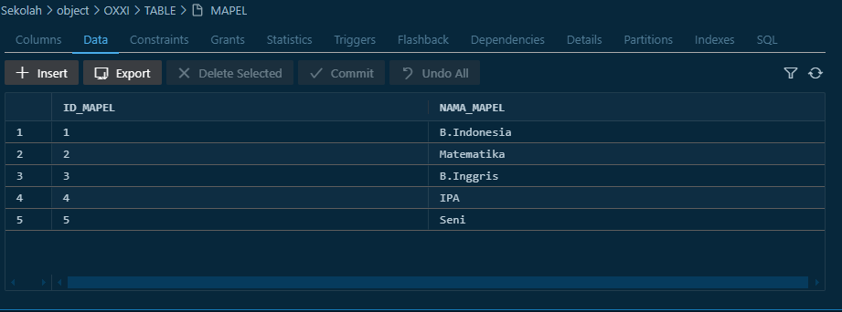
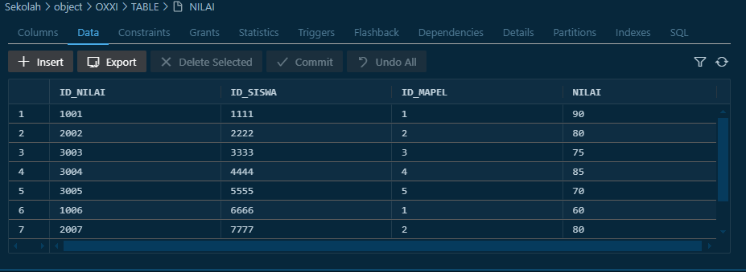
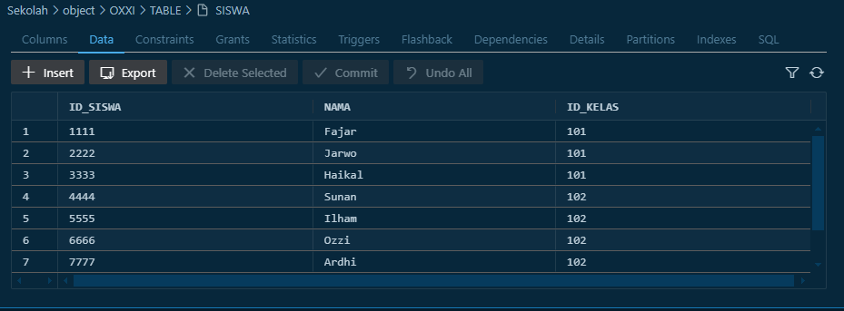
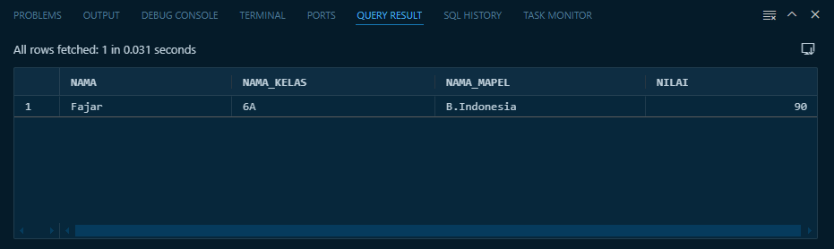

# 📚 Sistem Informasi Sekolah - Oracle Database

Ini adalah project sederhana database untuk sistem informasi sekolah menggunakan **Oracle Database 21c**. Dibuat menggunakan SQL dan dijalankan melalui **VS Code** dan **Oracle SQL Developer**.

## 🔧 Fitur Database

- Data Guru
- Data Siswa
- Data Mapel
- Jadwal Pelajaran
- Nilai Siswa
- Relasi antar tabel (FK)

## 🗃️ Struktur Tabel

- `GURU(id_guru, nama, mapel_spesialis)`
- `MAPEL(id_mapel, nama_mapel)`
- `KELAS(id_kelas, nama_kelas, wali_kelas)`
- `SISWA(id_siswa, nama, id_kelas)`
- `JADWAL(id_jadwal, id_kelas, id_mapel, id_guru, hari, jam)`
- `NILAI(id_nilai, id_siswa, id_mapel, nilai)`

## 🔗 Relasi Utama

- `wali_kelas` → `GURU.id_guru`
- `id_kelas` → `KELAS.id_kelas`
- `id_mapel` → `MAPEL.id_mapel`
- `id_guru` → `GURU.id_guru`

## 🖼️ Screenshot

**Data Guru**

**Data jadwal**

**Data Kelas**

**Data Mapel**

**Data Siswa**

**Data Siswa**

**menampilkan nilai dari siswa dengan pelajaran b.indonesia di kelas 6a**
